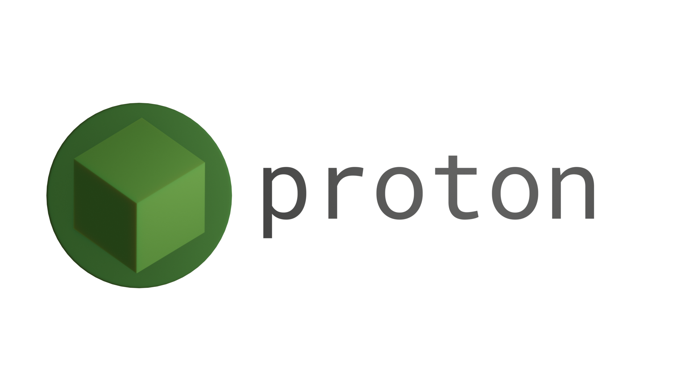

The Proton engine is a game engine that is designed to focus on 3 things:
- Performance
- Ease of use
- Uniformity across platforms\
...and is right now only developed for the web.
## How can I just use the thing?
Proton.JS -- the only version of this -- has been tested to work on Google Chrome.
If you're using Proton3D locally on Google Chrome, you must enable the flag `--disable-web-security` with `--user-data-dir` to bypass some CORS issue that I forgot about a long time ago. On Windows 10, it would look like this:
```
C:\Program Files (x86)\Google\Chrome\Application\chrome.exe --disable-web-security --user-data-dir=./temp
```
(where `./temp` is the directory where Chrome's files will be stored)\
If you do not have the best processor in the world, it is a good idea to disable v-sync. You can do that with these two flags: `--disable-gpu-vsync` and `--disable-frame-rate-limit`. With every flag, it would look like this:
```
C:\Program Files (x86)\Google\Chrome\Application\chrome.exe --disable-web-security --user-data-dir=./temp --disable-gpu-vsync --disable-frame-rate-limit
```  
Make sure no other windows of the browser are open!

## Alright! How do I contribute?
Well, you're in luck because I don't really know what to put here.
Everything is (at leased supposed to be) written in [Mr.doob's Code Style](https://github.com/mrdoob/three.js/wiki/Mr.doob's-Code-Style%E2%84%A2), and make sure to make your own branch(es) before changing this git.

## What are the goals/disclaimers for the Proton engine?
- The Proton engine is designed to be cross-platform (or more specifically, cross-programming-language) so that developers can use the same code across different platforms and "base-engines".
- All versions except betas of the engine are guaranteed to not be changed in such a way as to break code designed for older versions.

## What's your current roadmap for the Proton engine?
1) Source-ifying proton.js (ex: getting a Source-like console with Source-like commands). DISCLAIMER: I really don't know how to use Source. At all.
2) Polishing proton.js so that it can run smoothly on low performance devices.
