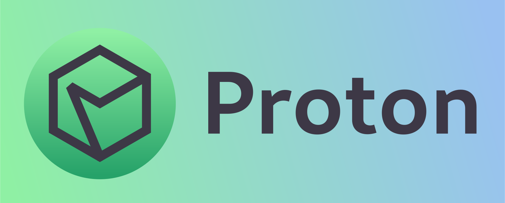

The Proton engine is a free and open source game engine with these core focuses:
- Performance
- Ease of use
- Flexibility
and
- Being a different game engine: one where both novices and experts can program their games with code instead of visual environments.

# To-Do

1. [ ] PBR Support.
2. [ ] Support 3D-sound stuff.
3. [ ] Support mesh animations.
4. [ ] Create a terminal tool to help set up a Proton project (?)

# How can I use Proton?
Check out the getting started guide at [proton-documentation.readthedocs.io](https://proton-documentation.readthedocs.io/)!

# How do I contribute?
DISCLAIMER: I have never contributed to anything nor have I had anything contributed to as of yet. If by any means you know of a better (or any) way to do this, please let me know!
- Make new contributions to the `beta` branch: please don't add new changes to the `stable` branch.
- Make sure your code hasn't broken the engine by running self-tests first.
- All code is written in [Mr.doob's Code Style™](https://github.com/mrdoob/three.js/wiki/Mr.doob's-Code-Style%E2%84%A2).

# What are the goals/disclaimers for the Proton engine?
- All stable releases are guaranteed to not be changed in such a way as to break code designed for older versions, unless a migration guide is issued.
- Proton is an engine in development. I don't know what I'm going to do with it, but I promise to work on it for a long time!
